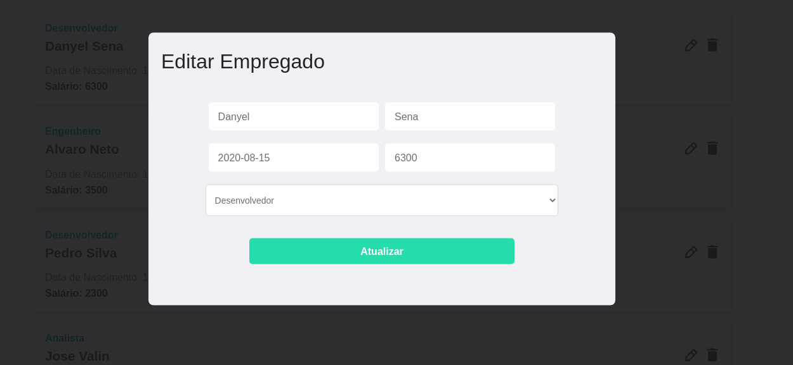

## Como Rodar

Clone o repositório em uma pasta de sua preferência, entre na pasta do projeto (cd "nome da pasta"). Para instalar as dependências, com npm rode o comando "npm install", se estiver usando yarn basta rodar "yarn". Inicie o projeto React com o comando "yarn start". Para executar a api rode o comando "npx json-server --watch db.json --port 3030" ou "yarn json-server --watch db.json --port 3030" no yarn. Após isso o projeto deve estar funcionando perfeitamente.

## Tecnologias

Projeto desenvolvido com React no front, utilizando apenas Hooks nativos sem frameworks para gerenciamento de estado. Para a api foi utilizado o package "json-server" que simula uma fake api possibilitando utilizar recursos simulares a uma api real. Toda a api é baseada no arquivo db.json, dele saem os nomes das rotas e seus respectivos métodos HTTP (get, post, etc), configurados automaticamente.

## Imagens

### Pesquisa

### Editar

### Criar 

